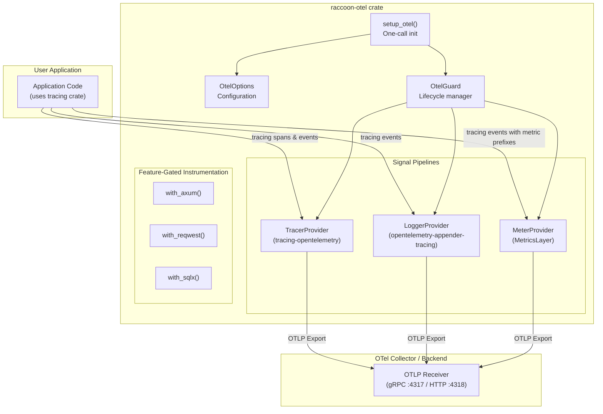
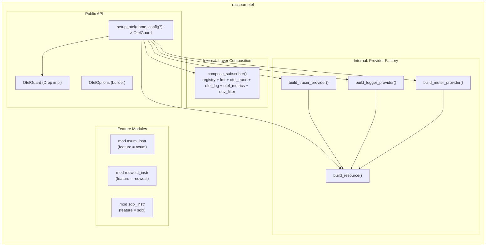
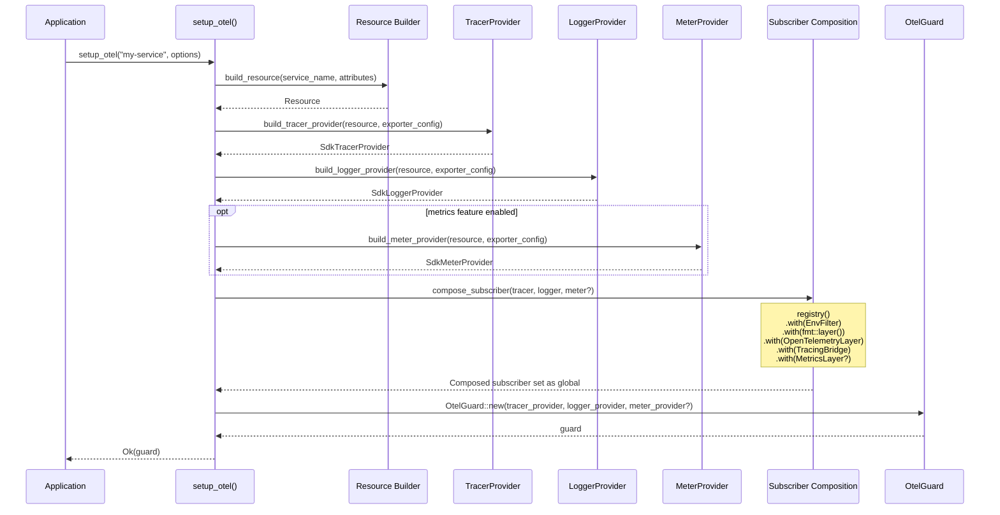
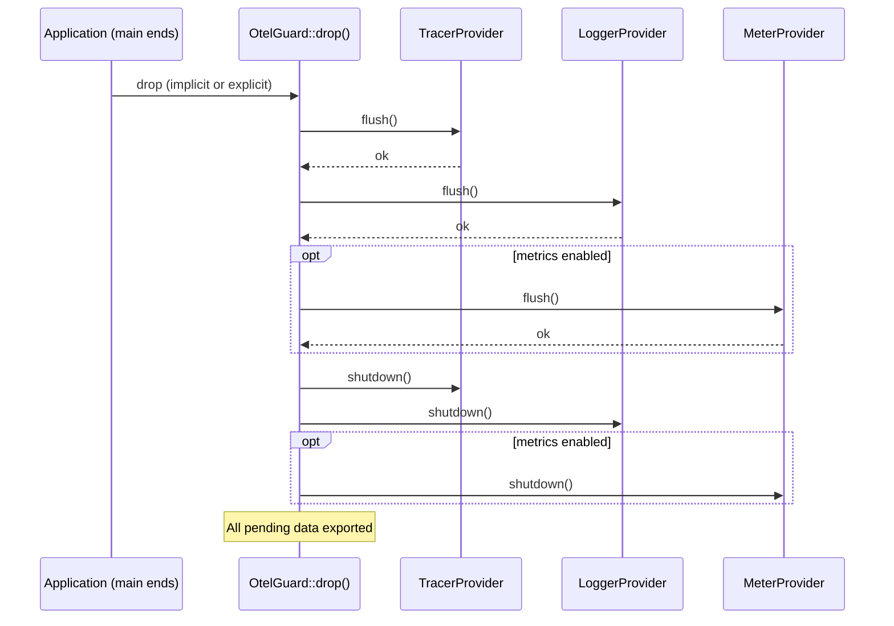

# Architectural Plan: Rust OpenTelemetry Drop-In Crate

## 1. Executive Summary

This document proposes a Rust crate (working name: **`raccoon-otel`**) that provides a drop-in, minimal-disruption bridge from the `tracing` crate to OpenTelemetry. It mirrors the philosophy of the existing Python (`simple-log-factory-ext-otel`) and C# (`Raccoon.Extensions.OpenTelemetry`) packages: **one function call to enable OTel export for applications that already use `tracing`**.

---

## 2. Problem Statement

The current Rust OpenTelemetry setup requires:

- **6-8 crate dependencies** with tightly coupled, non-obvious version alignment
- **60-80 lines of boilerplate** to wire up traces, logs, and metrics
- **Manual lifecycle management** (the "OtelGuard" problem -- if providers are dropped, spans silently vanish)
- **Split concerns across separate crates**: `tracing-opentelemetry` for spans, `opentelemetry-appender-tracing` for logs, and the `MetricsLayer` for metrics
- **Fragile version coupling**: `tracing-opentelemetry` 0.32 works with `opentelemetry` 0.31 (off-by-one)

The Python and C# packages solve this with one-call setup. Rust deserves the same.

---

## 3. Existing Alternatives Assessment

| Crate                            | Covers Traces | Covers Logs | Covers Metrics | One-Call Init | Guard Lifecycle | Feature-Gated Instrumentation |
|----------------------------------|---------------|-------------|----------------|---------------|-----------------|-------------------------------|
| `tracing-opentelemetry`          | Yes           | No          | Partial        | No            | No              | No                            |
| `opentelemetry-appender-tracing` | No            | Yes         | No             | No            | No              | No                            |
| `init-tracing-opentelemetry`     | Yes           | Partial     | No             | Yes           | Yes             | No                            |
| **Proposed crate**               | Yes           | Yes         | Yes            | Yes           | Yes             | Yes                           |

**Verdict**: No existing crate provides a complete, ergonomic, all-three-signals solution with feature-gated auto-instrumentation. `init-tracing-opentelemetry` is the closest but lacks log export, metrics, and instrumentation bundles.
Building a new crate is justified.

---

## 4. Design Principles (Aligned with Python & C# Packages)

1. **Drop-in**: One function call. Existing `tracing` code works unchanged.
2. **Minimal disruption**: No changes to existing `#[instrument]`, `tracing::info!()`, span macros.
3. **Opinionated defaults, escape hatches**: Production-ready out of the box; customizable when needed.
4. **Feature-gated**: Auto-instrumentation for HTTP servers/clients/databases are opt-in via Cargo features.
5. **Safe lifecycle**: A guard type manages all providers; dropping it triggers graceful shutdown/flush.
6. **Version shield**: Re-export key types so users don't need to directly depend on `opentelemetry` crates.

---

## 5. Architecture

### 5.1 C4 Level 2: Container Diagram



### 5.2 C4 Level 3: Component Diagram



---

## 6. Public API Design

### 6.1 Minimal Usage (Mirror of C# One-Liner)

```
// Cargo.toml
// [dependencies]
// raccoon-otel = { version = "0.1", features = ["grpc"] }

let _guard = raccoon_otel::setup_otel("my-service", None)?;

tracing::info!("This now goes to stdout AND OTel backend");
```

### 6.2 Configured Usage (Mirror of Python's setup_otel)

```
let _guard = raccoon_otel::setup_otel("my-service", Some(
    OtelOptions::builder()
        .endpoint("http://collector:4317")
        .protocol(Protocol::Grpc)
        .resource_attributes([("deployment.environment", "production")])
        .headers([("Authorization", "Bearer token123")])
        .export_timeout(Duration::from_secs(30))
        .build()
))?;
```

### 6.3 With Feature-Gated Instrumentation (Mirror of C#'s WithWebApi/WithSqlClient)

```
let _guard = raccoon_otel::setup_otel("my-service", Some(
    OtelOptions::builder()
        .endpoint("http://collector:4318")
        .protocol(Protocol::HttpProtobuf)
        .with_axum(AxumOptions { excluded_paths: vec!["/health"] })
        .with_reqwest()
        .build()
))?;
```

### 6.4 OtelGuard Lifecycle

```
// Guard keeps providers alive. On drop:
// 1. Flushes all pending spans, logs, metrics
// 2. Shuts down all providers gracefully
// 3. Logs shutdown status

// Explicit shutdown also available:
guard.shutdown();
```

### 6.5 Full API Surface

| Item | Type | Description |
|---|---|---|
| `setup_otel(service_name, options?)` | Function | One-call init. Returns `Result<OtelGuard>` |
| `OtelOptions` | Struct (builder) | All configuration. Env-var fallbacks for every field |
| `OtelGuard` | Struct (Drop) | Holds all providers. Flush + shutdown on drop |
| `Protocol` | Enum | `Grpc`, `HttpProtobuf`, `HttpJson` |
| `AxumOptions` | Struct | `excluded_paths: Vec<String>` |
| `ReqwestOptions` | Struct | Reserved for future config |

---

## 7. Configuration Hierarchy

Priority (highest to lowest):

1. **Programmatic** -- `OtelOptions::builder().endpoint("...")`
2. **Environment variables** -- `OTEL_EXPORTER_OTLP_ENDPOINT`, `OTEL_SERVICE_NAME`, etc.
3. **Defaults** -- `http://localhost:4317` (gRPC) or `:4318` (HTTP)

Supported env vars (per OTel spec):

| Variable | Maps to |
|---|---|
| `OTEL_SERVICE_NAME` | service name resource attribute |
| `OTEL_EXPORTER_OTLP_ENDPOINT` | base endpoint |
| `OTEL_EXPORTER_OTLP_PROTOCOL` | `grpc`, `http/protobuf`, `http/json` |
| `OTEL_EXPORTER_OTLP_HEADERS` | key=value pairs |
| `OTEL_EXPORTER_OTLP_TIMEOUT` | timeout in ms |
| `OTEL_TRACES_SAMPLER` | sampler type |
| `OTEL_TRACES_SAMPLER_ARG` | sampler argument |
| `OTEL_LOG_LEVEL` | env_filter directive |
| `RUST_LOG` | env_filter directive (standard) |

---

## 8. Cargo Feature Flags

```
[features]
default = ["grpc", "traces", "logs"]

# Transport
grpc = ["opentelemetry-otlp/grpc-tonic"]
http = ["opentelemetry-otlp/http-proto", "opentelemetry-otlp/reqwest-client"]

# Signals (traces and logs on by default; metrics opt-in)
traces = []
logs = []
metrics = []

# Compression
gzip = ["opentelemetry-otlp/gzip-tonic", "opentelemetry-otlp/gzip-http"]
zstd = ["opentelemetry-otlp/zstd-tonic", "opentelemetry-otlp/zstd-http"]

# TLS
tls = ["opentelemetry-otlp/tls-roots"]
tls-webpki = ["opentelemetry-otlp/tls-webpki-roots"]

# Auto-instrumentation (all opt-in)
axum = ["dep:axum", "dep:tower-http"]
reqwest = ["dep:reqwest-tracing", "dep:reqwest-middleware"]

# Async runtimes
rt-tokio = ["opentelemetry_sdk/rt-tokio"]
rt-tokio-current-thread = ["opentelemetry_sdk/rt-tokio-current-thread"]
```

**Default features rationale**: gRPC + traces + logs mirrors what most users want immediately. Metrics is opt-in because it requires the `MetricsLayer` convention (specially-prefixed events) which existing code won't already use.

---

## 9. Dependency Tree

```
raccoon-otel
├── tracing (re-export)
├── tracing-subscriber (registry, fmt, EnvFilter)
├── tracing-opentelemetry (OpenTelemetryLayer, MetricsLayer)
├── opentelemetry (API)
├── opentelemetry_sdk (SDK)
├── opentelemetry-otlp (OTLP exporter)
├── opentelemetry-appender-tracing (log bridge)
│
├── [feature: axum] tower-http (TraceLayer)
├── [feature: axum] axum (types only)
├── [feature: reqwest] reqwest-tracing
└── [feature: reqwest] reqwest-middleware
```

All `opentelemetry*` version pins will be managed centrally. The crate will **re-export** key types (e.g., `opentelemetry::global`, `tracing_opentelemetry::OpenTelemetrySpanExt`) so users rarely need direct `opentelemetry` dependencies.

---

## 10. Crate Structure

```
raccoon-otel/
├── Cargo.toml
├── src/
│   ├── lib.rs              # Public API: setup_otel, re-exports
│   ├── options.rs           # OtelOptions builder
│   ├── guard.rs             # OtelGuard (lifecycle, Drop impl)
│   ├── resource.rs          # Resource builder (service name + attributes)
│   ├── providers/
│   │   ├── mod.rs
│   │   ├── tracer.rs        # TracerProvider factory
│   │   ├── logger.rs        # LoggerProvider factory
│   │   └── meter.rs         # MeterProvider factory
│   ├── subscriber.rs        # Layer composition (registry + layers)
│   ├── env.rs               # Environment variable parsing
│   ├── instrumentation/
│   │   ├── mod.rs
│   │   ├── axum.rs          # feature = "axum"
│   │   └── reqwest.rs       # feature = "reqwest"
│   └── re_exports.rs        # Curated re-exports
└── tests/
    ├── integration_test.rs
    └── env_config_test.rs
```

---

## 11. Mapping to Existing Packages

| Concept | Python Package | C# Package | Rust Crate (Proposed) |
|---|---|---|---|
| One-call setup | `setup_otel()` | `builder.AddOpenTelemetry()` | `setup_otel()` |
| All-in-one factory | `otel_log_factory()` | `AddOpenTelemetry` + `With*()` chain | `setup_otel()` + `OtelOptions::builder().with_*()` |
| Configuration | Constructor params | `OpenTelemetryOptions` record | `OtelOptions` builder |
| Lifecycle | `atexit` hook + `shutdown()` | DI container manages lifetime | `OtelGuard` (Drop impl) |
| Log handler | `OtelLogHandler` | `AddOpenTelemetry` (auto via ILogger) | `OpenTelemetryTracingBridge` layer (auto via tracing) |
| Tracer | `OtelTracer` | `ActivitySource` (native .NET) | `tracing` spans (native Rust) |
| Web server | `instrument_fastapi()` | `WithWebApi()` | `.with_axum()` |
| HTTP client | `instrument_requests()` | Auto via HttpClient instrumentation | `.with_reqwest()` |
| Database | `instrument_db()` | `WithSqlClient()` / `WithNpgsql()` / `WithEntityFrameworkCore()` | Not needed -- sqlx has native tracing support |
| Protocol choice | `protocol="grpc"/"http"` | `OtlpProtocol.HttpProtobuf/Grpc` | `Protocol::Grpc/HttpProtobuf/HttpJson` |

---

## 12. ADR-001: All Three Signals by Default vs Opt-In

### Status
Proposed

### Context
The Python package supports logs + traces (not metrics). The C# package supports all three. The Rust ecosystem has all three available but split across crates.

### Decision Drivers
- Drop-in philosophy: maximize value with minimum config
- Compile time impact: more features = longer builds
- Existing code compatibility: most apps already emit `tracing` spans and events

### Considered Options

**Option A: All three on by default**
- Pros: Maximum observability immediately
- Cons: Metrics require specially-prefixed events; existing code won't benefit

**Option B: Traces + Logs default; Metrics opt-in**
- Pros: Traces and logs work with existing `tracing` usage. Metrics requires code changes anyway.
- Cons: Users who want metrics must enable feature

### Decision
**Option B**: `default = ["grpc", "traces", "logs"]`. Metrics enabled via `features = ["metrics"]`.

### Rationale
Existing Rust apps using `tracing` already emit spans (traces) and events (logs). These export to OTel with zero code changes. Metrics require the `monotonic_counter.*` / `histogram.*` event convention, which existing code won't use. Adding it by default adds compile-time cost without benefit.

---

## 13. ADR-002: Guard-Based Lifecycle vs Global Registration

### Status
Proposed

### Context
OpenTelemetry providers in Rust must be kept alive or spans/logs silently vanish. This is the #1 footgun in the ecosystem.

### Considered Options

**Option A: Return OtelGuard (RAII)**
- Pros: Rust-idiomatic; compile-time reminder (`#[must_use]`); deterministic shutdown
- Cons: User must hold the guard (typically `let _guard = ...` in main)

**Option B: Global registration only (no guard returned)**
- Pros: Nothing to hold onto
- Cons: No deterministic flush/shutdown; `atexit` is unreliable in Rust; matches no Rust idiom

### Decision
**Option A**: Return `#[must_use] OtelGuard`. Also register providers globally for context propagation.

### Rationale
This is the established Rust pattern (see `tracing_subscriber::set_global_default`, `init-tracing-opentelemetry`'s `OtelGuard`). The `#[must_use]` attribute prevents accidental drops. The guard's `Drop` impl calls `flush()` then `shutdown()` on all three providers.

---

## 14. ADR-003: Database Instrumentation Strategy

### Status
Proposed

### Context
The Python package instruments psycopg2/psycopg. The C# package instruments SqlClient, Npgsql, EF Core, and Cosmos DB. In Rust, sqlx (the dominant async database crate) has **native `tracing` support** built in.

### Considered Options

**Option A: Feature-gated database instrumentation modules (like C#)**
- Pros: Consistent with C# package design
- Cons: Unnecessary -- sqlx already emits tracing spans

**Option B: No database instrumentation module; document that sqlx/diesel/sea-orm work automatically**
- Pros: Simpler crate; no redundant work; follows Rust ecosystem conventions
- Cons: Less "batteries-included" feel

### Decision
**Option B**: No database instrumentation module. Document in README that sqlx, sea-orm, and other tracing-aware database crates automatically produce OTel spans when `raccoon-otel` is initialized.

### Rationale
Unlike Python (psycopg2 has no native OTel) and C# (SqlClient needs explicit instrumentation), Rust's database ecosystem already uses `tracing`. Our crate's `OpenTelemetryLayer` automatically converts those spans to OTel. Adding a database module would be redundant.

---

## 15. ADR-004: Crate Packaging -- Single Crate vs Workspace

### Status
Proposed

### Context
The C# package uses a family of 6 NuGet packages. The Python package is a single pip package with optional extras.

### Considered Options

**Option A: Single crate with feature flags (like Python)**
- Pros: Simple dependency management; single version to track; familiar Cargo pattern
- Cons: All code in one crate; feature combinations can get complex

**Option B: Workspace with multiple crates (like C#)**
- Pros: Clean separation; independent versioning
- Cons: Users must coordinate multiple crate versions; more complex publishing

### Decision
**Option A**: Single crate with feature flags.

### Rationale
Rust's feature flag system handles this elegantly. Feature-gated modules for `axum` and `reqwest` only compile when enabled, adding zero cost when disabled. This matches the Python package's approach and is more idiomatic in Rust than a multi-crate workspace for what is fundamentally one concern (OTel setup).

---

## 16. Implementation Roadmap

### Phase 1: Core (MVP)
- `setup_otel()` with traces + logs export
- `OtelOptions` builder with endpoint, protocol, headers, timeout
- `OtelGuard` with flush + shutdown on Drop
- `Protocol::Grpc` and `Protocol::HttpProtobuf`
- Env var fallbacks
- `#[must_use]` on guard
- Re-exports of key types
- Unit tests + integration test with in-memory exporter

### Phase 2: Instrumentation
- `with_axum()` -- tower-http TraceLayer integration
- `with_reqwest()` -- reqwest-tracing middleware helper
- Documentation: how sqlx/sea-orm/diesel work automatically

### Phase 3: Metrics + Polish
- `metrics` feature flag with `MetricsLayer`
- Compression features (gzip, zstd)
- TLS features
- `HttpJson` protocol support
- Examples directory (axum app, CLI app, reqwest client)

### Phase 4: Advanced
- Custom sampler configuration
- Header propagation helpers (inject/extract convenience methods)
- `TracedLogger`-equivalent wrapper (if demand exists)
- `with_actix()` instrumentation

---

## 17. Sequence Diagram: Initialization Flow



---

## 18. Sequence Diagram: Shutdown Flow



---

## 19. Risk Assessment

| Risk                                                       | Probability | Impact | Mitigation                                                                          |
|------------------------------------------------------------|-------------|--------|-------------------------------------------------------------------------------------|
| Upstream OTel crates break API (pre-1.0)                   | High        | Medium | Pin versions; re-export types; provide migration guide per version                  |
| `tracing-opentelemetry` version drift from `opentelemetry` | High        | High   | Central version management; CI tests against latest compatible set                  |
| Users need customization beyond `OtelOptions`              | Medium      | Low    | `configure_tracer`/`configure_logger` escape hatches (like C#'s `ConfigureTracing`) |
| Feature flag combinations cause compile errors             | Low         | Medium | CI matrix testing all feature combinations                                          |
| Guard dropped too early in async contexts                  | Medium      | High   | `#[must_use]` attribute; documentation; examples showing correct placement          |

---

## 20. Comparison Summary

```
Python (setup_otel):
  handler, tracer = setup_otel("my-service", endpoint="...")
  logger = log_factory(__name__, custom_handlers=[handler])

C# (AddOpenTelemetry):
  builder.AddOpenTelemetry("my-service", o => {
      o.OtlpEndpoint = new Uri("...");
      o.WithWebApi();
  });

Rust (proposed):
  let _guard = setup_otel("my-service", Some(
      OtelOptions::builder()
          .endpoint("...")
          .with_axum(Default::default())
          .build()
  ))?;
```

All three follow the same core philosophy: **one call, everything works, existing code unchanged**.

If you need to take inspiration from the Python or C# packages, they are located here:
1. Python package: Z:\dev\misc\pair-problem-solving-with-claude\reference-repos\log-factory-package-ext-otel
2. C# Package family: Z:\dev\misc\pair-problem-solving-with-claude\reference-repos\raccoon-ninja-otel